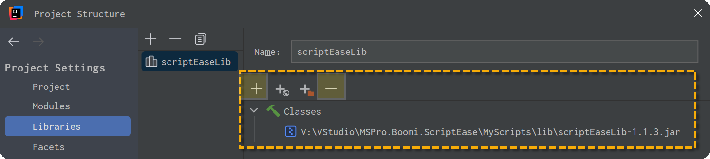

# The lib directory

The ScriptEase Library provides the magic to develop, debug and test Groovy Script for Boomi Integration with IntelliJ. The `lib` directory contains the ScriptEase Library that is referenced and used by the project (see IntelliJ Project References).

## Update the library in your project

To update the library used in your project, download the latest version from this page, and save it to you project *.\lib* directory. You should find another `scriptEaseLib-x.y.z.jar` in that directory which we are going to replace by the new version.

* Open your project Module Settings (F4)

* Remove the old library `[-]`, and add the new one `[+]`

## Licensing

If you have purchased a license, the license file `scriptease.license.json` must be stored in this directory. The `scriptease.license`file that appears here is used to cache license information to speed-up starting. If you delete it, it'll be refreshed and the first start will take a bit longer.