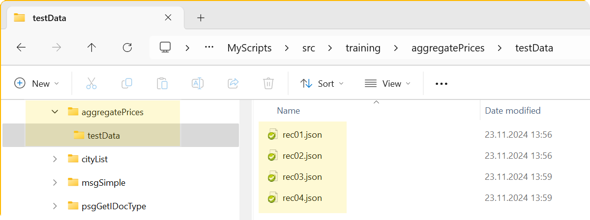
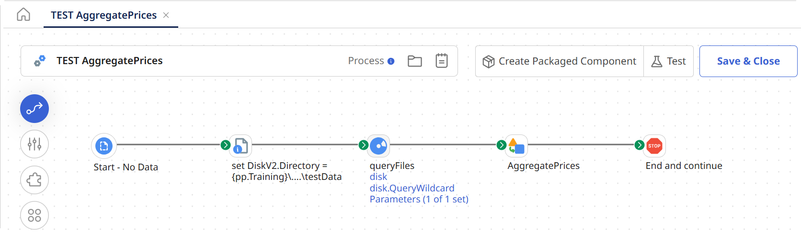
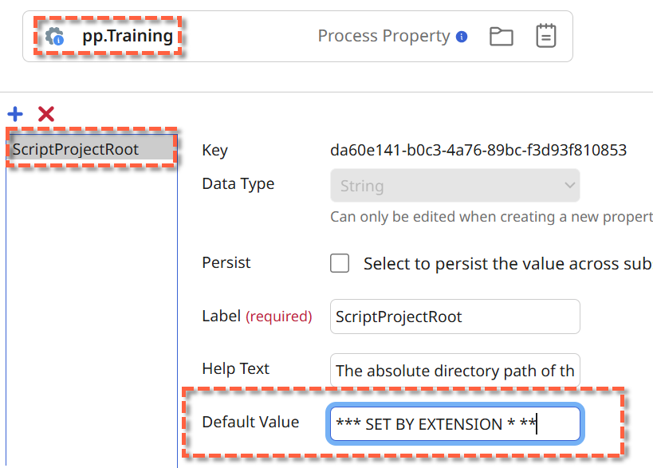
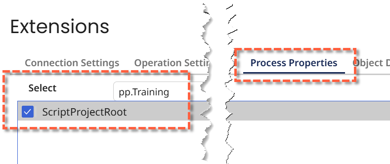
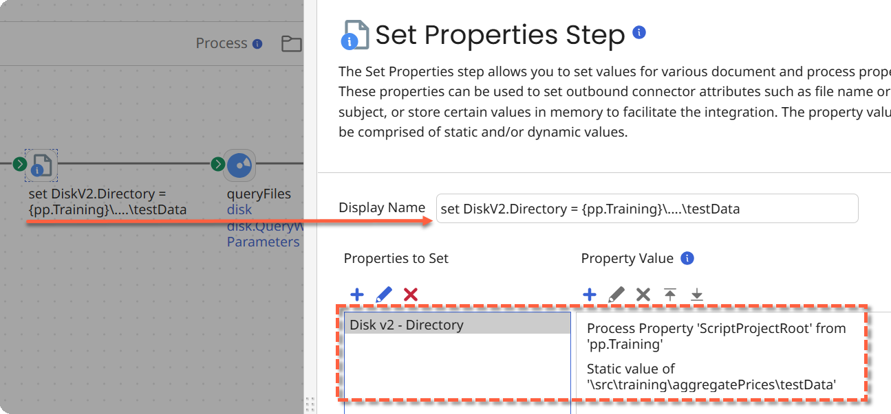
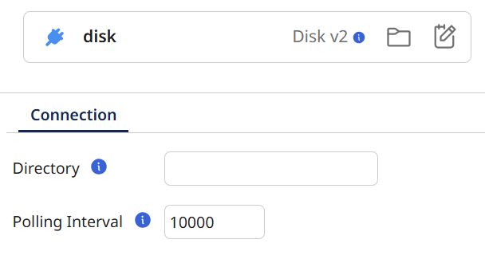
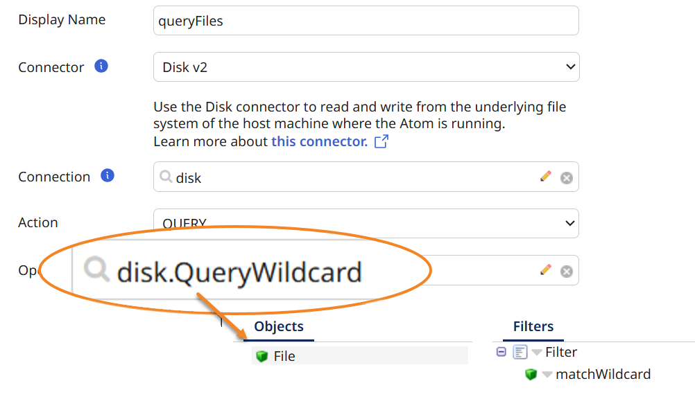
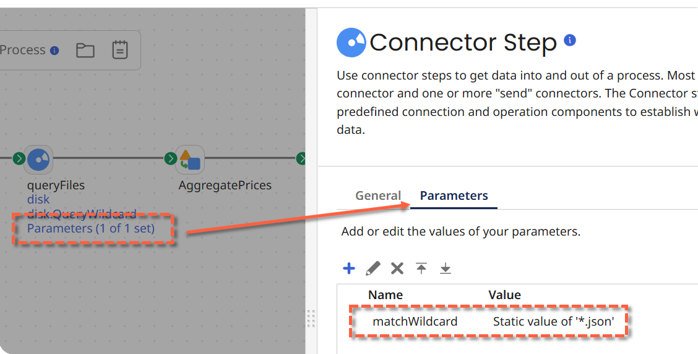
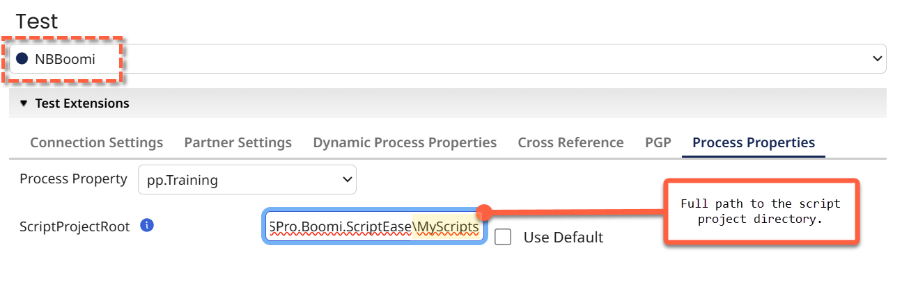
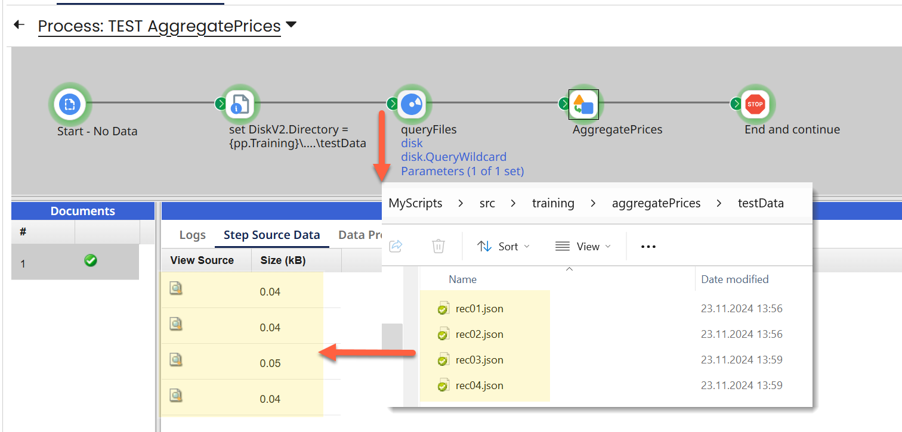

# Aggregate Prices

This script is documented in the [Aggregate Prices Example | The MSPro Boomi Collection (gitbook.io)](https://mspro.gitbook.io/the-mspro-boomi-collection/boomi-scriptease/examples).

## The Boomi Process

:exclamation: **IMPORTANT**
The Boom Process must run on a local ATOM because we are reading files from the local disk!

Build a Boomi Integration Test process which uses the *Aggregate Prices* Script with the same test-data files as this script. Test-data is located in `{projectDir}\src\training\aggregatePrices` (project directory is where the *IML* files resides) and there are four files:

## Process Overview

This is how the complete process will look like:

* Configure Disk v2 Connector
* Query files from local disk
* Execute Script with the example documents

## 1 - Process Property for Configuration

The *trick* here is that the ATOM reads the test files from the same directory as the local script project: they share test data! To make this a bit more comfortable (configurable) we use a Process Property for the Training.

| Name                     | Description                                                  |
| ------------------------ | ------------------------------------------------------------ |
| `pp.Training`            | A Process Property that is used for training purposes.       |
| Key: `ScriptProjectRoot` | The absolute directory path of the Script IntelliJ project (IML files location). |

### Extensions

Leave the Default value to **SET BY EXTENSION**, we are going to provide the directory when we test (see below):

## Built the process

### Configure Disk v2 Connector

Caption: *set DiskV2.Directory = {pp.Training}\....\testData*
**Disk v2 - Directory**: pp.Training.ScriptProjectRoot + Relative Path to the test-data directory

### Query Files

Use the most generic Disk v2 Connector you can:

with a `disk.queryWildcard`operation:

The `matchWildcard` file-filter is then provided as a Shape Parameter:

Finally add the Script (Data Process Shape) and **Test** it.

Do not forget to extend the Training Process Property when you execute the process:

If you did it right, you will see the four documents which we used or local script testing flowing to your Data Process Shape.

